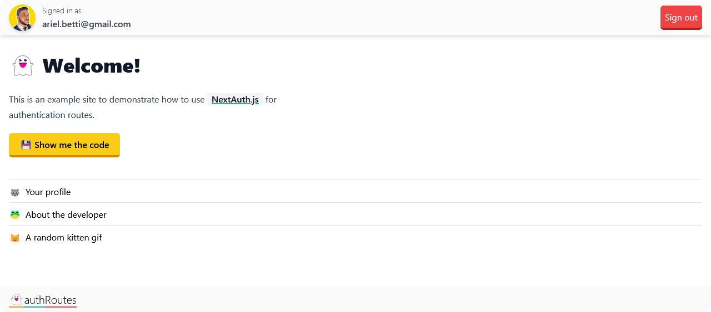

# 👋 Next Auth Routes
Authenticated routes with NextAuth.js in Next 13



## Getting Started

First, create a `.env.local` based in `.env.example`

```yaml
NEXTAUTH_URL=your url
NEXTAUTH_SECRET=openssl rand -base64 32
GITHUB_ID=your github_id
GITHUB_SECRET=your github app secret key
```

Run the development server:

```bash
npm run dev
# or
yarn dev
# or
pnpm dev
```

Open [http://localhost:3000](http://localhost:3000) with your browser to see the result.

## Application Provider
In `src/app/providers.ts` you a find the file responsible for the Authentication Provider, it is important for us to be able to access the session information outside the server-side renders or re-hydratation components.

```typeScript
export const NextAuthProvider = ({ children }: Props) => {
  return (
    <SessionProvider
      // Re-fetch session every 5 minutes
      refetchInterval={5 * 60}
      // Re-fetches session when window is focused
      refetchOnWindowFocus={false}
    >
      {children}
    </SessionProvider>
  );
};
```

## NextAuth Options
In the `src/pages/[...nextauth].ts` file you will configure the authentication providers you want, and the callback functions, you will need it for everything to work perfectly, you can change it according to your need.

```typeScript
export const authOptions: NextAuthOptions = {
  providers: [
    GithubProvider({
      clientId: process.env.GITHUB_ID as string,
      clientSecret: process.env.GITHUB_SECRET as string,
    }),
  ],
  callbacks: {
    session: async ({ session, token }) => {
      if (session?.user) {
        session.user.id = token.sub as string;
      }
      return session;
    },
  },
  session: {
    strategy: "jwt",
  },
  pages: {
    signIn: ROUTES.home,
  },
};
```

## Middleware
In the `src/middlewares.ts` file you will find the routes protected by authentication, all routes included in the matcher will be protected. you can add to the `pages` config in `[...nextauth].ts` the behavior of sending to the page you want.

```typeScript
export const config = {
  matcher: ["/auth/profile", "/auth/kitty", "/auth/about"],
};
```

## Learn More

To learn more about Next.js, take a look at the following resources:

- [Next.js Documentation](https://nextjs.org/docs) - learn about Next.js features and API.
- [Learn Next.js](https://nextjs.org/learn) - an interactive Next.js tutorial.
- [NextAuth.js](https://next-auth.js.org/getting-started/introduction) learn more about NextAuth.js features

You can check out [the Next.js GitHub repository](https://github.com/vercel/next.js/) - your feedback and contributions are welcome!

## Deploy on Vercel

The easiest way to deploy your Next.js app is to use the [Vercel Platform](https://vercel.com/new?utm_medium=default-template&filter=next.js&utm_source=create-next-app&utm_campaign=create-next-app-readme) from the creators of Next.js.

Check out our [Next.js deployment documentation](https://nextjs.org/docs/deployment) for more details.
